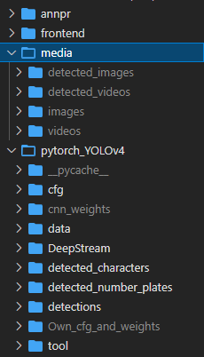
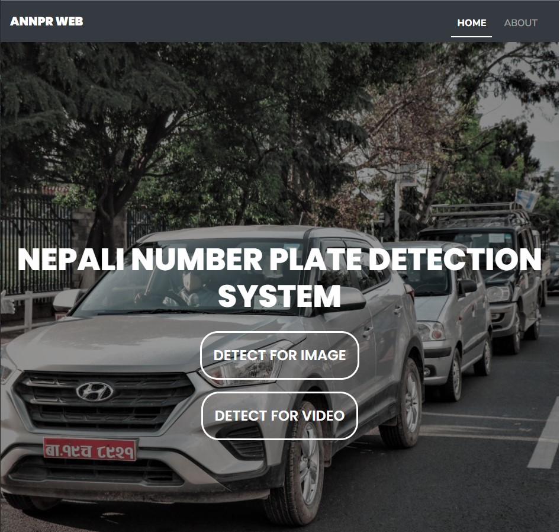
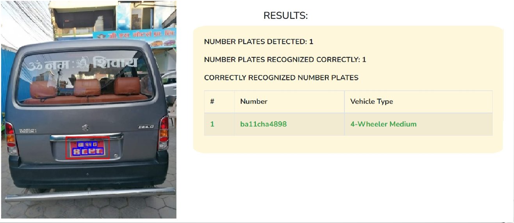

# Automatic Nepali Number Plate Recognition System (ANNPR)

ANNPR is a system that detects Nepali number plates from vehicles and then recognizes the number in the number plates. This project was done as a minor project in 6th Semester for Computer Engineering.  

We have used YOLOv4 for number plate detection, also YOLOv4 for character segmentation and CNN for character recognition and then finally integrated all the models with django webapp for user interaction.

YOLOV4 Link: [YOLOV4](https://github.com/AlexeyAB/darknet)

This is simply integrating the models and then testing the models trained by us for user inputs. 

____
## Setup in your PC 

To run this app correctly first you have to install all the requirements from requirements.txt.  
Also better use python 3.8.5 as I used the same version  
Python 3.8.5 Link: [Python 3.8.5](https://www.python.org/downloads/release/python-385/)
```
pip install -r requirements.txt
```
Then download and add these two folders Own_cfg_and_weights and cnn_weights inside pytorch_YOLOv4 folder 

Own_cfg_and_weights Link: [YOLO Weights and CFG](https://drive.google.com/drive/folders/1Q6TspUqPyHtS67Ziu_tYBIcSFCsOrTMT?usp=sharing)

cnn_weights: [CNN Weights](https://drive.google.com/drive/folders/1py_ITQW1UGr5kQUSYCiwBh-C6Mw8M3cI?usp=sharing)

Also Create a folder called media in this root directory of project and inside media create another 4 folders detected_images, detected_videos, images, videos  
Use this format:  
annpr(root diretory):
- annpr
- frontend 
- media(new folder you created)
    - detected_images (create these 4 folders too inside media)
    - detected_videos
    - images
    - videos
- pytorch_YOLOv4
    - cnn_weights(Create a new folder with this name and add the downloaded weights from above)
    - Own_cfg_and_weights(Create a new folder with this name and add the downloaded weights from above)

or simply download the media folder from here:
media folder: [Media Folder](https://drive.google.com/drive/folders/1LzcASbA5DW8-vVd7g-R2D-Eun3sPSdVe?usp=sharing)

### Your folders should look like this 


## To run webapp run command 
```
python manage.py runserver
```
<hr>

## Home Page UI



## Output Results 
### For an Image 


### For a Video


***
## Developed By
[Anish Shilpakar](https://github.com/JuJu2181)  
[Anjaan Khadka](https://github.com/AnjaanKhadka)  
[Sudip Shrestha](https://github.com/sudips413)  
[Sachin Manandhar](https://github.com/sachin035) 


***
*Feel Free to contact us if you want to know more about how we trained and integrated these models.*
